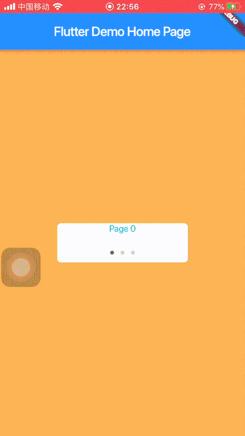

# flutter_banner

A Flutter banner widget, only build once after created.

## Getting Started
### 1、add dependency to you `pubspec.yaml`
```
    flutter_banner: ^1.0.0
```

### 2、user guide, see `example/example_main.dart` 
```
    import 'package:flutter_banner/banner_widget.dart'

    var delegate = BannerDelegate(
        childAtIndex: (idx) => Container(),
        numberOfBanners: 5,
        width: 200,
        hight: 60,
    );
    var banner = BannerWidget(
        delegate: delegate,
        pageIndicator: PageIndicator(numberOfPages: 5),
    );
```

#### `PageIndicator` style
#### ①Replace PageIndicator default style
```
    PageIndicator.normalIndicatorStyle = IndicatorStyle(Size(), BoxDecoration());
    PageIndicator.selectedIndicatorStyle = IndicatorStyle(Size(), BoxDecoration());
```
#### ②Custom `PageIndicator` style
```
    static Widget indicatorBuilder() {
        return Container();
    }

    static Widget selectedIndicatorBuilder() {
        return Container();
    }
    PageIndicator(indicatorBuilder: indicatorBuilder, selectedIndicatorBuilder: selectedIndicatorBuilder,);
```

### 3、support autoloop，user draging


